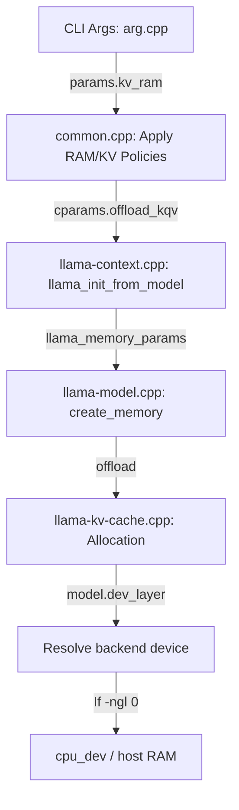

# Plan: Offload KV Cache to VRAM with Weights in Host RAM

## 1-Page Summary

### Context & Objective
In local LLM serving, users often encounter GPU VRAM bottlenecks when running large models. Currently, the `--kv-ram` flag allows weights to reside in GPU VRAM while offloading the KV cache to CPU host RAM. 
The laboratory requires the **inverse capability**: **keep the model weights primarily in host RAM** (using `-ngl 0` or minimal offloading) but **force the KV cache to reside entirely in GPU VRAM**. 

By offloading the KV cache to VRAM, we can run larger models (such as Gemma 2 27B) whose weights exceed VRAM but whose KV caches fit within the 10GB limit of an RTX 3080. Since attention calculations are highly memory-bandwidth intensive, keeping the KV cache in VRAM avoids transferring large volumes of history across the PCIe bus on every token, yielding a significant speedup (often 2-3x) over keeping both weights and KV cache in CPU RAM.

### Key Architectural Change
Currently, the device allocated for each layer's KV cache is determined by querying the device assigned to the model's weights for that layer (`model.dev_layer(il)`). When `-ngl 0` is set, all weight layers are assigned to the CPU, meaning the KV cache is also allocated in CPU host RAM. 
To resolve this, we will introduce:
1. A new command-line option: `--kv-vram-only`.
2. Core engine support to override the buffer type during KV cache allocation: if `--kv-vram-only` is active, any KV layer mapped to the CPU will instead be allocated on the first available discrete GPU.

### Feasibility & Verification
- **Feasibility**: High. `ggml_backend_sched` automatically handles tensor copies between the CPU and GPU. For a single token, only the query $Q$ (approx. 4KB) is copied to the GPU, and the attention output $O$ (approx. 4KB) is copied back. The bandwidth overhead is negligible.
- **Environment**: Windows 11, VS 18 Community, CUDA 13.2, SDK kits at `S:\WADK102`.
- **Target Hardware**: Single GPU NVIDIA RTX 3080 (10GB, Compute Capability 86).
- **Target Models**: Gemma 2 9B GGUF and Gemma 2 27B GGUF.

---

## Goal & Non-Goals

### Goal
- Allow model weights to run on the CPU (host RAM) while forcing all KV cache allocations (K and V buffers) to stay in GPU memory (VRAM).
- Support standard Transformer KV caches, KVarN structured caches, and recurrent memory state caches.
- Restrict PCIe transfers during autoregressive decoding to activation tensors ($Q$ and $O$), avoiding weight and KV cache round-trips.

### Non-Goals
- Supporting weight tensor splitting or tensor-parallel weight calculations when `--kv-vram-only` is active (weights remain entirely on CPU).
- Allowing CPU fallback for the KV cache layers if GPU VRAM is exhausted when `--kv-vram-only` is specified (allocation should fail explicitly).
- Optimizing CPU-side operations; this plan leverages the existing CPU execution backend for MLP and attention projections.

---

## Current Behavior Map

Here is the flow of variables and allocations under the current design:



### Key Symbols and Code Files
1. **CLI Registration**: [common/arg.cpp](file:///J:/LLM/engines/godzilla-llama.cpp/common/arg.cpp#L2340-L2352) registers `--kv-ram` and `-nkvo`.
2. **Context Parameter Structs**:
   - Public API: `struct llama_context_params` in [include/llama.h](file:///J:/LLM/engines/godzilla-llama.cpp/include/llama.h#L411)
   - Internal Context Params: `struct llama_cparams` in [src/llama-cparams.h](file:///J:/LLM/engines/godzilla-llama.cpp/src/llama-cparams.h#L13)
3. **Parameter Mapping**:
   - `common_context_params_to_llama` in [common/common.cpp](file:///J:/LLM/engines/godzilla-llama.cpp/common/common.cpp#L1693) maps `common_params` to the public API struct.
   - `llama_context_default_params` in [src/llama-context.cpp](file:///J:/LLM/engines/godzilla-llama.cpp/src/llama-context.cpp#L8531) sets defaults.
   - `llama_init_from_model` in [src/llama-context.cpp](file:///J:/LLM/engines/godzilla-llama.cpp/src/llama-context.cpp#L500) initializes the internal `llama_cparams` from public parameters.
4. **Memory Allocation**:
   - `llama_model::create_memory` in [src/llama-model.cpp](file:///J:/LLM/engines/godzilla-llama.cpp/src/llama-model.cpp#L2002) instantiates memory structures.
5. **Concrete Cache Classes**:
   - Standard: `llama_kv_cache::llama_kv_cache` in [src/llama-kv-cache.cpp](file:///J:/LLM/engines/godzilla-llama.cpp/src/llama-kv-cache.cpp#L279)
   - KVarN: `llama_kv_cache_kvarn` in [src/llama-kv-cache-kvarn.cpp](file:///J:/LLM/engines/godzilla-llama.cpp/src/llama-kv-cache-kvarn.cpp#L495)
   - Recurrent State: `llama_memory_recurrent` in [src/llama-memory-recurrent.cpp](file:///J:/LLM/engines/godzilla-llama.cpp/src/llama-memory-recurrent.cpp#L91)

---

## Proposed Changes

### CLI & API Modifications
We will introduce a new boolean flag `kv_vram_only` across the interfaces.

1. **`common/common.h`**
   Add to `struct common_params`:
   ```cpp
   bool kv_vram_only = false; // --kv-vram-only: force KV cache to VRAM
   ```

2. **`common/arg.cpp`**
   Add command-line flag parser and environment variable mapping:
   ```cpp
   add_opt(common_arg(
       {"--kv-vram-only"},
       "force the KV cache to VRAM: allocates the KV cache on GPU even if weights are primarily in host RAM (e.g. with -ngl 0)",
       [](common_params & params, bool value) {
           params.kv_vram_only = value;
       }
   ).set_env("LLAMA_ARG_KV_VRAM_ONLY"));
   ```
   Add validation logic in `common_params_parse_ex`:
   ```cpp
   if (params.kv_vram_only && params.no_kv_offload) {
       throw std::invalid_argument("error: --kv-vram-only cannot be used with --no-kv-offload (-nkvo)");
   }
   if (params.kv_vram_only && params.kv_ram) {
       throw std::invalid_argument("error: --kv-vram-only cannot be used with --kv-ram");
   }
   ```

3. **`include/llama.h`**
   Add to `struct llama_context_params`:
   ```cpp
   bool kv_vram_only; // force KV cache to VRAM even if weights are on host RAM
   ```

4. **`src/llama-cparams.h`**
   Add to `struct llama_cparams`:
   ```cpp
   bool kv_vram_only;
   ```

5. **`common/common.cpp`**
   Map flag in `common_context_params_to_llama`:
   ```cpp
   cparams.kv_vram_only = params.kv_vram_only;
   ```

6. **`src/llama-context.cpp`**
   - Initialize `/*.kv_vram_only =*/ false` in `llama_context_default_params()`.
   - Map parameter `cparams.kv_vram_only = params.kv_vram_only;` in `llama_init_from_model()`.

---

## Data-Path & Device Overrides

To implement the core override, we will modify the allocation code blocks in the three backend cache files. If `kv_vram_only` is true, and the model weight layer device is CPU, we will redirect the allocation to the first available GPU device in a round-robin or single-target fashion.

### Helper Device Resolution Logic
Inside the constructors, we will locate the discrete GPU devices using `model.devices`.
```cpp
ggml_backend_dev_t dev = model.dev_layer(il);
if (kv_vram_only && ggml_backend_dev_type(dev) == GGML_BACKEND_DEVICE_TYPE_CPU) {
    std::vector<ggml_backend_dev_t> gpu_devs;
    for (const auto & d : model.devices) {
        if (ggml_backend_dev_type(d.dev) == GGML_BACKEND_DEVICE_TYPE_GPU) {
            gpu_devs.push_back(d.dev);
        }
    }
    if (!gpu_devs.empty()) {
        // Distribute layers across available GPUs
        dev = gpu_devs[il % gpu_devs.size()];
    } else {
        LLAMA_LOG_WARN("%s: --kv-vram-only specified but no discrete GPU device detected; falling back to CPU\n", __func__);
    }
}
```

### File-Specific Implementation Edits

1. **`src/llama-kv-cache.cpp`**: Update constructor signature to accept `bool kv_vram_only` and insert the resolution block at line 280.
2. **`src/llama-kv-cache-kvarn.cpp`**: Update constructor signature to accept `bool kv_vram_only` and insert resolution logic around line 495.
3. **`src/llama-memory-recurrent.cpp`**: Update constructor signature to accept `bool kv_vram_only` and insert resolution logic around line 91.
4. **`src/llama-model.cpp`**:
   Update `llama_model::create_memory` to forward `cparams.kv_vram_only` into the constructors of all concrete cache/memory implementations:
   - `llama_kv_cache_dsa`
   - `llama_memory_recurrent`
   - `llama_memory_hybrid_iswa`
   - `llama_memory_hybrid`
   - `llama_kv_cache_iswa`
   - `llama_kv_cache`

---

## Phased PR Steps

### Phase 1: Interface & Context Definitions
- Add the `kv_vram_only` variable to structural definitions in public and internal headers:
  - `include/llama.h`
  - `src/llama-cparams.h`
  - `src/llama-memory.h`
- Compile and run basic validation.

### Phase 2: CLI Parsing & Mapping
- Add command-line flag parser registration in `common/arg.cpp`.
- Map the variable through `common/common.cpp` and `src/llama-context.cpp`.
- Validate that passing `--kv-vram-only` executes without compilation errors and sets parameters correctly.

### Phase 3: Core Memory Allocator Redirection
- Modify constructors of `llama_kv_cache`, `llama_kv_cache_kvarn`, and `llama_memory_recurrent` to accept the override flag.
- Implement the device-redirection logic in the three cache files.
- Adapt the wrapper instantiation calls inside `src/llama-model.cpp` to supply the parameter.

### Phase 4: Integration & Build Verification
- Perform clean rebuilds using the lab toolchain via `rebuild_king.cmd`.
- Verify DLL packaging layout matches requirements.

---

## Test Plan (Single-GPU 3080 10GB)

### Prerequisites (from [docs/WINDOWS-BUILD-TOOLCHAIN.md](file:///J:/LLM/engines/godzilla-llama.cpp/docs/WINDOWS-BUILD-TOOLCHAIN.md))
- Compiler env must be established by prepending the UCRT paths:
  ```bat
  call scripts\env-godzilla-msvc.cmd
  ```
- Rebuild Godzilla with CMake and Ninja:
  ```bat
  rebuild_king.cmd
  ```

### Test Case 1: Gemma 2 9B GGUF
- **Command**:
  ```bat
  llama-server.exe -m path/to/gemma-2-9b.gguf -ngl 0 --kv-vram-only -c 8192 --cache-type-k f16 --cache-type-v f16
  ```
- **Expectation**: Model weights load in CPU host memory. Model loading output logs should indicate that model layers are assigned to CPU. However, KV cache allocations should report CUDA/GPU devices.
- **VRAM target**: ~2.7 GB (for KV Cache) + ~0.5 GB system overhead = **~3.2 GB VRAM**.

### Test Case 2: Gemma 2 27B GGUF
- **Command**:
  ```bat
  llama-server.exe -m path/to/gemma-2-27b.gguf -ngl 0 --kv-vram-only -c 8192 --cache-type-k f16 --cache-type-v f16
  ```
- **Expectation**: Runs successfully on the RTX 3080 10GB (which normally cannot fit a 27B model's weights + KV cache).
- **VRAM target**: ~5.75 GB (for KV Cache) + ~0.5 GB system overhead = **~6.25 GB VRAM**.

---

## Success Metrics

| Metric | Target | Verification Method |
|--------|--------|---------------------|
| **Execution Performance** | $\ge 2.0\times$ speedup | Compare tokens/sec between `--kv-vram-only` and CPU-only decoding (no offloading). |
| **Max Context Support** | 8192 context size | Generate full context sequence without out-of-memory errors on Gemma 2 27B GGUF. |
| **VRAM Resident Weights** | $\approx 0$ MB VRAM | Verify through Windows taskmgr/nvidia-smi that VRAM does not increase by the size of the weights. |
| **KV Cache Allocation** | 100% in VRAM | Confirm that the allocated buffer types in log statements match CUDA device allocations. |

---

## Rollback & Safety Plan
- **Deactivation**: If `--kv-vram-only` causes crashes or instability, users can simply omit the flag; the default behavior matches standard llama.cpp memory mapping.
- **Compilation Reversion**: The flag is fully guarded and encapsulated. If it needs to be reverted entirely, git checkout on the modified files is straightforward as no core structural files outside of parameters and cache constructors are affected.

---

## Open Questions & Risks

1. **Flash Attention Execution Path**:
   - When weights are on CPU, the query tensor $Q$ is computed on CPU. Will the scheduler successfully copy $Q$ to VRAM to execute CUDA Flash Attention?
   - *Analysis*: Yes, `ggml_backend_sched` handles cross-backend dependencies by inserting copy nodes. However, performance must be monitored to ensure the copies do not bottleneck execution.
2. **Quantized / KVarN Cache Compatibility**:
   - Do compressed KV caches (e.g. `turbo4`, `q4_0`, `kvarn4`) work seamlessly when forced to GPU memory?
   - *Analysis*: Yes. Quantized caches utilize GPU kernels for unpacking and compute, which are fully supported by CUDA 13.2. If a layer is non-compatible, it falls back to a standard type, which will also be forced to VRAM.
3. **Out-of-VRAM Failures**:
   - What happens when a user attempts a context size that exceeds VRAM (e.g., Gemma 2 27B with 16k context, requiring ~11.5 GB VRAM)?
   - *Analysis*: GGML context buffer allocation will fail and throw a standard runtime error. We must ensure the error message is clean and points users to VRAM size limitations.
